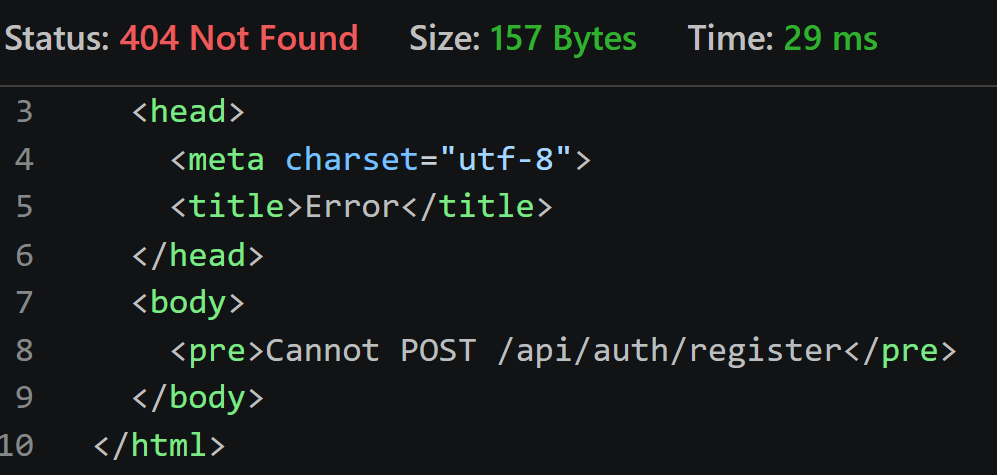
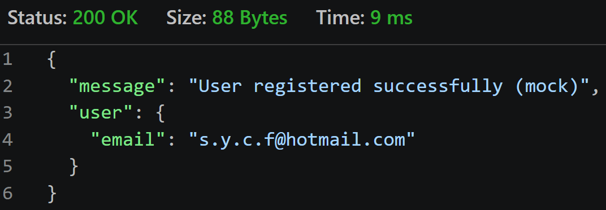

# Testing - FlowBachata

## 1. Objetivo del testing
Este documento describe las pruebas realizadas manualmente para comprobar el correcto funcionamiento de la aplicación FlowBachata (frontend + backend).

---

## 2. Pruebas realizadas

###  Autenticación

- Registro de usuario funciona correctamente
- Login crea usuario en contexto global
- Redirección a dashboard después de login
- Logout elimina usuario del contexto

---

###  Rutas (React Router)

- Página / carga correctamente (Home)
- /login muestra formulario de login
- /register muestra formulario de registro
- /dashboard es accesible solo si hay usuario logueado
- Ruta protegida redirige a /login si no hay usuario
- Página 404 funciona para rutas inexistentes

---

###  API Backend

- GET /api/v1/users/:userId devuelve datos correctamente
- GET /api/v1/health responde con status OK
- CORS habilitado correctamente

---

###  Capa de red (Frontend)

- Manejo de loading en UI
- Manejo de errores en UI

---

###  UI / Responsive

- Diseño funciona en desktop
- Layout responsivo básico
- Componentes reutilizables renderizan correctamente
- Estilos con Tailwind aplicados correctamente

---

## 3. Errores encontrados y solución

- Ningún error crítico detectado durante pruebas manuales.
- Se corrigieron errores de tipado en la capa de API.

---

## 4. Conclusión
```Bash
La aplicación FlowBachata funciona correctamente en frontend y backend, cumpliendo con la arquitectura fullstack definida.
```

POST 






GET


DEL


